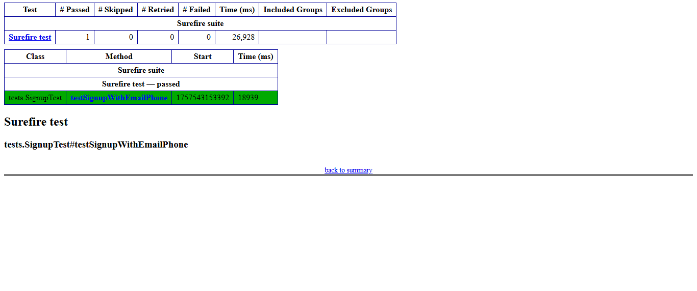

# BoxCommerce Signup Automation


## Project Overview
This project contains a basic automation script for testing the **signup flow** on the BoxCommerce website:

[Signup page link](https://dashboard-uat.boxcommerce.com/en-GB/auth/sign-up)

The automation ensures that a user can successfully register using email and phone number.

---

## Framework, Tools, and Libraries Used

| Tool / Library | Version | Purpose |
|----------------|--------|---------|
| **Java**       | 21     | Programming language for the automation scripts |
| **Selenium**   | 4.16.0 | Automates browser interactions for testing the signup flow |
| **TestNG**     | 7.11.0 | Test framework for organizing and running automated tests |
| **WebDriverManager** | 5.5.3 | Automatically manages browser drivers (Chrome in this project) |
| **Maven**      | 3.9.9 | Build and dependency management |

**Why these tools:**
- **Selenium** is widely used for web automation and allows interaction with dynamic elements.
- **TestNG** provides annotations, assertions, and reporting features.
- **WebDriverManager** removes the need to manually download, set up, or maintain browser drivers (like ChromeDriver). It automatically manages the driver binaries, ensures version compatibility with the installed browser, and simplifies test execution across different environments.
- **Maven** simplifies dependency management and project setup.

---

## Prerequisites

Java 21 (https://www.oracle.com/java/technologies/downloads/) installed

Maven (https://maven.apache.org/install.html) installed

Google Chrome (https://www.google.com/chrome/) installed

ChromeDriver is automatically handled by WebDriverManager — no manual setup required.

## Project Structure
```
BoxCommerceSignupTest/
│
├─ src/
│ ├─ main/
│ │ └─ java/
│ │ ├─ pages/
│ │ │ └─ SignupPage.java
│ │ └─ SignupTestBoxCommerce/
│ │ └─ Main.java
│ │
│ └─ test/
│ └─ java/
│ ├─ base/
│ │ └─ BaseTest.java
│ └─ tests/
│ └─ SignupTest.java
│
├─ LICENSE
├─ pom.xml
├─ README.md
├─ testng.xml
```

---

## How to Run the Test

1. **Clone the repository**
```bash
git clone https://github.com/ramybahy/BoxCommerceSignupTest.git
```

```bash
cd BoxCommerceSignupTest
```
2. Run the tests

From command line:

```bash
mvn test
```
Or from IntelliJ:

Open the project

Right-click SignupTest.java → Run 'SignupTest'

The test will:

- Open the signup page in Chrome.

- Close any popup if present.

- Fill in first name, last name, country, phone, email, and password.

- Submit the form and verify the success message.


Viewing Test Results:

- After running the test with:
 
 mvn test

TestNG reports are generated automatically by the Maven Surefire Plugin in the folder:

target/surefire-reports/

Inside this folder, you will find:

index.html → A detailed report of the executed tests.

emailable-report.html → A clean summary report that can be shared easily.

To view results, simply open target/surefire-reports/emailable-report.html in a browser.

Example test result screenshot:




Notes:

- Unique emails and phone numbers are generated for each test run to avoid conflicts.

- Explicit waits ensure that dynamic elements like popups and buttons are fully rendered before interacting.

- Logging/console prints help visualize each step of the signup process.
